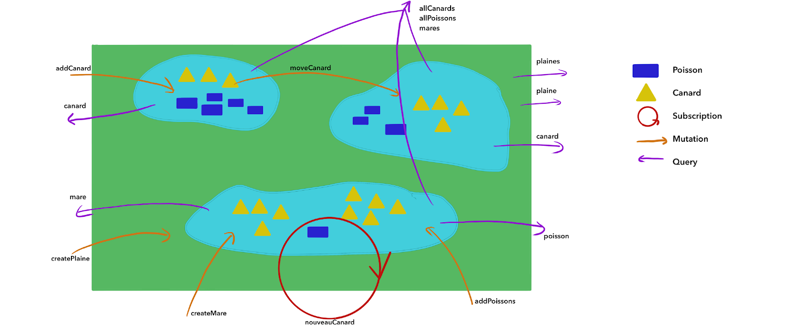

# nc-graphql-2019

Repository for TPs of the NightClazz on GraphQL at Bordeaux (04/02/19)



## Step 3 - Mutations

In this step, you'll need to add some Mutations to play with the context :

- one for creating a "Plaine" (no params)
- one for adding a "Canard" (required _mareId_, optionnal _name_)
- one for adding a "Poisson" (required _mareId_, required _quantity_)
- one for adding moving a "Canard" from one "Mare" to another (required _newMareId_, required _id_)

An example is present in the mutation.js file.
The name of the arguments must match between your schema and your mutation.js file.

To create a mutation with the prisma client you'll need a code that looks like this:

```javascript
module.exports = {
    myMutationName: (_, args, context) {
        // first argument is the root object, but useless here
        return context.prisma.myEntityName.create({
            data: {
                ...args
            }
        })
    }
}
```

Here we create a mutation called `myMutationName` to create an instance of `myEntityName` with some data.
Data must be defined in the graphQL Schema.
